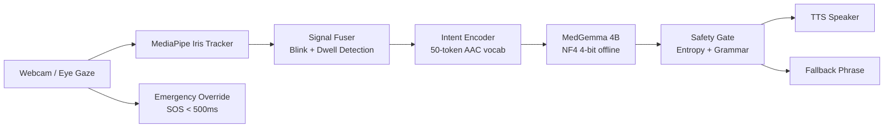

# NeuroWeave Sentinel

**Offline assistive communication for people who can only move their eyes.**

Built for the [Kaggle MedGemma Impact Challenge](https://www.kaggle.com/competitions/medgemma). This system lets a patient with ALS or locked-in syndrome look at a symbol grid with a standard webcam, select a few medical tokens by holding their gaze, and hear a full sentence spoken aloud — all without internet, a server, or any physical button press.

The LLM running this is MedGemma 4B, quantized to 4-bit so it fits on modest hardware.

---

## The Problem

People with ALS or locked-in syndrome are fully conscious but can't speak, type, or move their limbs. Current communication aids either need expensive hardware, require cloud connectivity, or produce robotic, context-free output that doesn't sound like natural speech.

This project asks: what if a standard $30 webcam and a local LLM could give someone their voice back, even offline in a hospital room with no Wi-Fi?

---

## How It Works

1. **The webcam watches your eyes** using MediaPipe's iris landmark tracker (468 face points, 30 FPS).
2. **You look at a symbol grid.** Hold your gaze on a cell for 1.5 seconds — it selects. No button needed.
3. **You build an intent** by selecting 2–3 tokens: a body part, a sensation, and an urgency level.
4. **MedGemma 4B reconstructs a sentence.** The token bundle is formatted into a medical prompt and the model generates something like: *"I have severe chest pain that started suddenly and is getting worse."*
5. **A safety check runs.** The output is scored on entropy, grammar, and confidence. If it scores too low, it falls back to a pre-written safe phrase instead of speaking uncertain output.
6. **The sentence is spoken aloud** via text-to-speech. A caregiver hears it without looking at a screen.
7. **Emergency at any time.** Looking up and holding for 1.5 seconds triggers an immediate SOS alarm — no LLM involved, sub-500ms latency.

---

## Architecture



---

## Key Features

- **No internet at runtime.** The model runs fully offline after a one-time download.
- **Standard webcam only.** No eye-tracker hardware, no headset, no IR camera.
- **Medically coherent output.** MedGemma is trained on clinical text — it produces sentences a nurse or doctor can act on.
- **Emergency bypass.** A single sustained upward gaze fires an alarm in under 500ms, bypassing the LLM entirely.
- **Safety-first output.** Three validation layers (entropy, grammar, confidence) block uncertain output before it reaches the speaker.
- **Web dashboard.** A real-time FastAPI + WebSocket dashboard lets caregivers monitor gaze, FSM state, and sentence output from any browser on the local network.
- **Simulator mode.** Run and test with keyboard arrows instead of a webcam — useful for development or demos.
- **Structured logging.** Every session is written to JSONL for later audit or clinical review.

---

## Safety & Reliability

This system communicates medical information. A wrong output could cause harm. Three things prevent that:

**1. Entropy Guard**
Before the model finishes generating, each token's softmax distribution is checked. If the model looks uncertain (high entropy across candidates), the output is flagged.

**2. Grammar Check**
The final sentence is validated offline using LanguageTool with a JRE fallback to regex rules. Fragments, nonsense, or structurally broken sentences are caught here.

**3. Confidence Scorer**
A composite score combines entropy (35%), grammar (30%), sentence length (20%), and generation latency (15%). Anything below 0.45 is discarded and replaced with a pre-written safe fallback like *"I need help — please check on me."*

The LLM also has a hard 2.3-second cutoff. If inference takes longer, it times out and falls back immediately.

---

## Offline Guarantee

Once the model is downloaded, nothing in this system needs internet:

| Component | How it works offline |
|---|---|
| Gaze tracking | MediaPipe runs locally, no API calls |
| LLM inference | Hugging Face `transformers` + weights on disk |
| Grammar check | LanguageTool runs as a local JRE process |
| Text-to-speech | `pyttsx3` uses system TTS engine (espeak / SAPI) |
| Emergency audio | Pre-recorded `.wav` files in `assets/audio/` |
| Web dashboard | Served locally via `uvicorn` on the same machine |

The only thing that needs internet is the one-time model download.

---

## Hardware Requirements

| Component | Minimum | Recommended |
|---|---|---|
| Python | 3.11+ | 3.12 |
| RAM | 6 GB | 8 GB |
| VRAM | 0 GB (CPU fallback) | 4 GB (GPU) |
| Webcam | Any USB / built-in | 720p, 30 FPS |
| OS | Linux / Windows / macOS | Ubuntu 22.04 |

GPU is optional. On CPU, inference takes ~15–20 seconds. On a 4 GB GPU, it's under 2.3 seconds.

---

## Setup

**1. Clone the repo**

```bash
git clone https://github.com/anujbolewar/MedGemma-Impact.git
cd MedGemma-Impact
```

**2. Create environment and install dependencies**

```bash
python -m venv venv
source venv/bin/activate       # Windows: venv\Scripts\activate
pip install -r requirements.txt
```

**3. Download MedGemma 4B (one-time, ~9 GB)**

You need to accept the model license at [huggingface.co/google/medgemma-4b-it](https://huggingface.co/google/medgemma-4b-it) first.

```bash
python scripts/setup_model.py --token hf_YOUR_TOKEN_HERE
```

This downloads and caches the model to `~/.cache/huggingface/hub/`.

**4. Download MediaPipe FaceLandmarker model**

```bash
wget -O models/face_landmarker.task \
  https://storage.googleapis.com/mediapipe-models/face_landmarker/face_landmarker/float16/1/face_landmarker.task
```

---

## Running the Demo

**Simulator mode (no webcam needed)**

```bash
python main.py --mode sim --no-gui --model-path ./models/medgemma-4b
```

**Webcam mode with web dashboard**

```bash
python main.py --web --mode webcam --model-path ./models/medgemma-4b --port 7860
```

Then open `http://localhost:7860` in a browser.

**Webcam mode with Tkinter UI**

```bash
python main.py --mode webcam --model-path ./models/medgemma-4b
```

**Simulator controls (keyboard)**

| Key | Action |
|---|---|
| Arrow keys | Move gaze direction |
| Space | Blink (select cell) |
| `b` | Long blink (next page) |
| F1 | Emergency override |
| Escape | Reset current tokens |

---

## AAC Token Vocabulary

The patient selects 2–3 tokens to describe their condition. MedGemma expands these into a full sentence.

| Page | Category | Example tokens |
|---|---|---|
| 0 | Body part | chest, abdomen, left arm, throat, bladder... |
| 1 | Sensation | pain, burning, nausea, shortness of breath... |
| 2 | Urgency / Intensity | right now, getting worse, severe, unbearable... |

50 tokens total across 3 pages.

---

## Folder Structure

```
neuroweave-sentinel/
├── core/
│   ├── fsm.py             # 9-state finite state machine
│   ├── constants.py       # Single source of truth for all system constants
│   └── logger.py          # Structured JSONL session logger
├── input/
│   ├── gaze_webcam.py     # MediaPipe FaceLandmarker webcam tracker
│   ├── gaze_sim.py        # Keyboard-driven gaze simulator
│   └── signal_fuser.py    # Blink + dwell → fused signal
├── encoder/
│   ├── token_vocab.py     # 50-token AAC vocabulary
│   └── intent_encoder.py  # Token accumulator → IntentBundle
├── llm/
│   ├── model_loader.py    # NF4 → int8 → fp16 loader with fallback
│   └── reconstructor.py   # Prompt builder + threaded inference + timeout
├── safety/
│   ├── entropy_guard.py   # Per-token entropy validation
│   ├── grammar_check.py   # LanguageTool + regex grammar check
│   └── confidence.py      # 4-component composite scorer
├── output/
│   ├── tts_engine.py      # Non-blocking TTS worker thread
│   └── emergency.py       # Zero-LLM emergency broadcaster
├── pipeline/
│   └── controller.py      # Main orchestrator, FSM, EventBus
├── ui/
│   ├── web_app.py         # FastAPI + WebSocket dashboard backend
│   ├── static/index.html  # Single-page patient dashboard
│   ├── main_window.py     # Tkinter desktop UI
│   └── widgets.py         # Gaze ring, symbol cells, confidence badge
├── tests/                 # Unit + integration tests
├── scripts/               # Setup and benchmark utilities
├── config/sentinel.yaml   # All runtime configuration
├── assets/audio/          # Pre-recorded emergency WAV files
├── models/                # Model weights (gitignored)
├── logs/                  # Session JSONL logs (gitignored)
├── requirements.txt
└── main.py                # CLI entry point
```

---

## Limitations

Being honest about what this is and isn't:

- **Gaze accuracy drops in poor lighting.** The tracker needs reasonable ambient light and prefers the camera at eye level.
- **GPU strongly recommended.** On CPU, inference is 15–20 seconds — too slow for real clinical use. The 2.3s target needs a 4 GB GPU.
- **Not a certified medical device.** This is a research prototype built for a hackathon. It has not been validated in a clinical setting and should not replace professional AAC tools.
- **50-token vocabulary is limited.** Real AAC systems have hundreds of symbols. This is enough for basic medical needs but not full communication.
- **Single face only.** The tracker handles one person at a time. If multiple faces appear in frame, it picks the first one.
- **Emergency trigger can misfire.** Sustained upward gaze of 1.5 seconds is the trigger. Unintentional triggers are possible, though a 10-second cooldown reduces repeated false alarms.

---

## What Could Be Better

Things worth improving if this goes further:

- **Personal calibration.** Let each patient calibrate the gaze dead-zone to their specific eye movement range.
- **Larger vocabulary with word prediction.** Use gaze history + MedGemma to suggest the next symbol before it's selected.
- **Streaming TTS.** Speak the sentence as tokens generate instead of waiting for the full output.
- **Caregiver alert via local network.** Push emergency notifications to a nurse's tablet over the same Wi-Fi.
- **Session replay.** Let clinicians review a patient's full communication history from JSONL logs.
- **Smaller, faster model.** MedGemma 2B or a fine-tuned version specifically for this 50-token vocabulary would cut latency further.

---

## License

Apache 2.0

---

> **Clinical disclaimer:** This is a research prototype submitted to the Kaggle MedGemma Impact Challenge. It is not a certified medical device and should not be used as a substitute for approved clinical communication tools.
